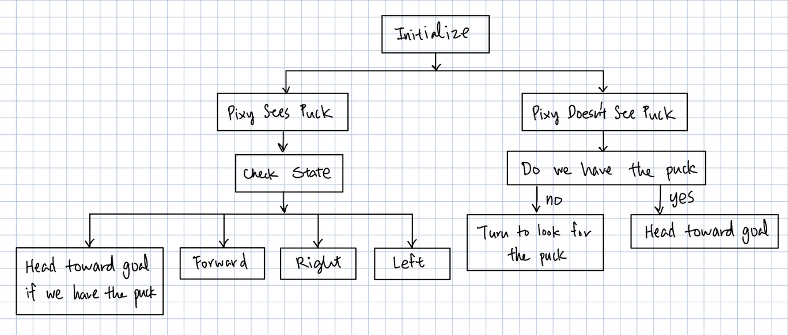
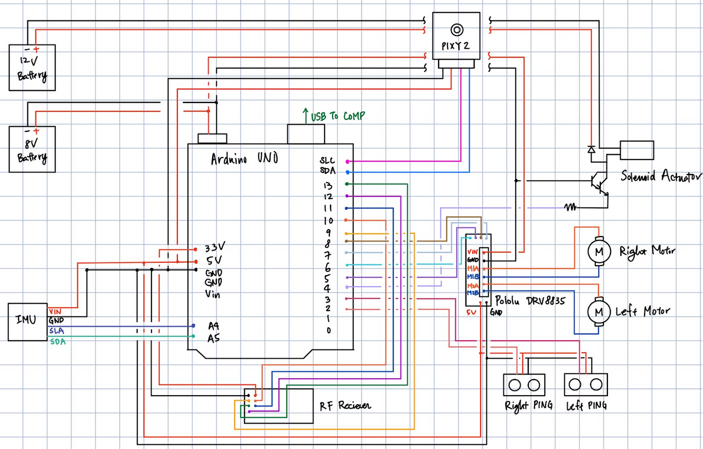
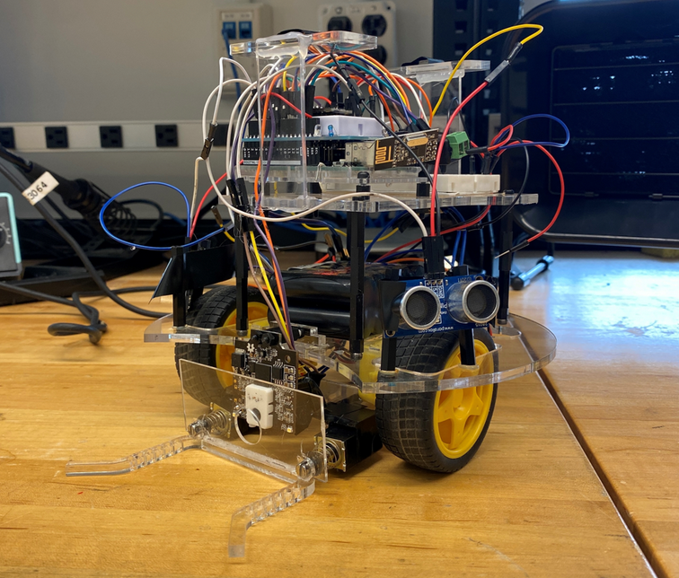
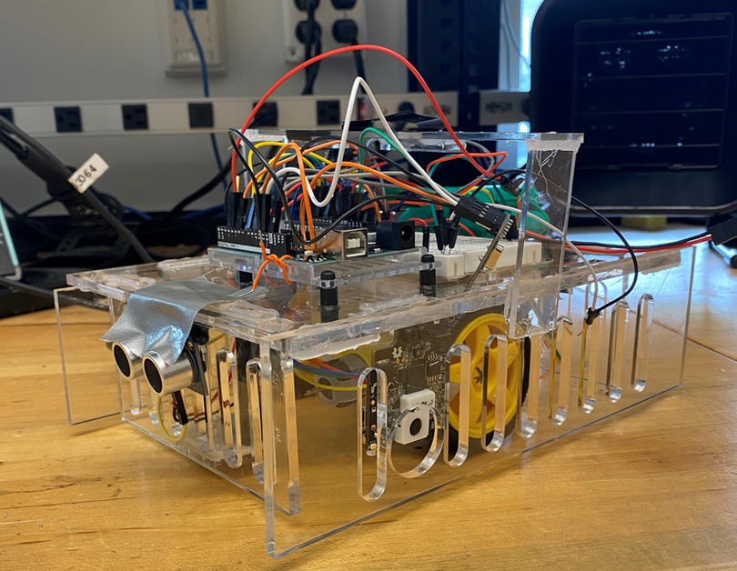

# Hockey-robots
Autonomous hockey robots project with a striker robot and a goalie robot. Each robot recieved location information broadcasted over RF transmitter linked to an overhead camera.

Striker robot decision workflow:

Circuit Diagram:

Striker:

Goalie:

